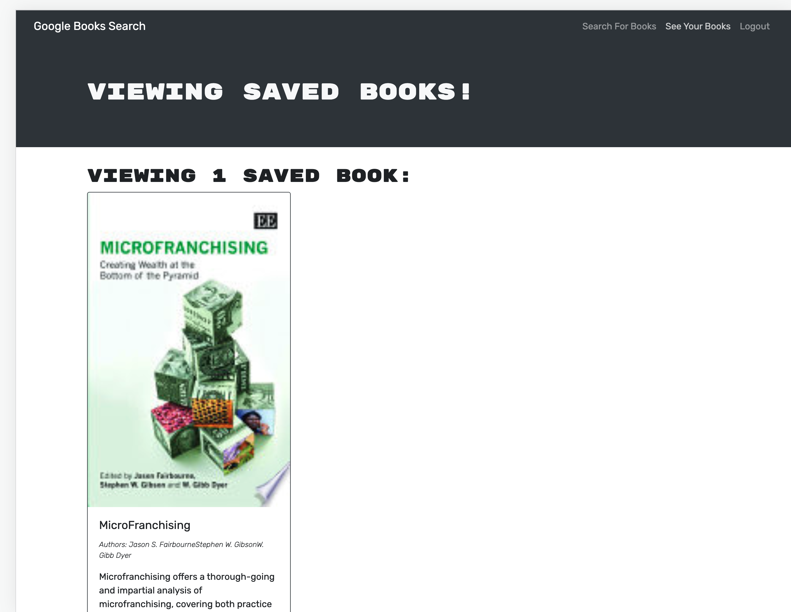

# I Heart Books App

  
    

  ## Table of Contents
  - [Project description](#Description)
  - [Useage](#Usage)
  - [Installation](#Installation)
  - [Contributors](#Contributors)
  - [Questions](#Questions)
  - [License](#License)

  ## Description
This application is for an assignment to take a working MERN stack application that uses the REST api and change it GraphQL.  You can search books and keep of list of book you want to save.  The original starter code can be found [here](https://github.com/coding-boot-camp/solid-broccoli)

  ## Usage
  
  This application is deployed live [here](https://sleepy-ocean-10567.herokuapp.com/)

  ## Installation
  - First clone the respository.
  - Install the dependancies with `npm install`
  - Run `npm run develop` to start the application.
  - Optionally  you can seed the database by stopping the server and running `npm run seed` 
  - Run the server again with `npm run dev`
   

  ## Contributors
  Natalie Fairbourne

  ## Tests
  none

  ## Questions
  If you have questions about this project, please contact developer at:
  - natalie@yoodlize.com 
  - [GitHub](https://github.com/nadybee)

  ## License
    none

